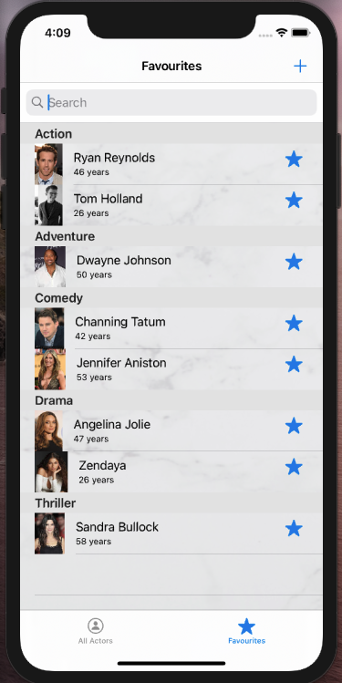
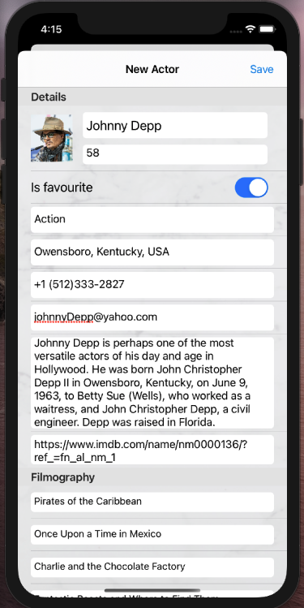

#  Actors

## By Robert-Adrian Bucur

**Actors** is a multi-screen application that shows a list of actors grouped by their main category of films, in a `UITableView`. Each actor is displayed in a `UITableViewCell` with some details about them, like profile image, name, age and if the actor is categorized as favourite or not. Also the first screen is a `UITabBarController` with two tabs: one that displays all the actors, and another that lists only the favourites actor, based on user's choice in the first tab. An actor can be set as favourite by pressing the `☆` button by their side in the first tab; therefore if the user presses the star for an actor that is already a favourite, they will be set as not favourite and will be deleted from the list in the *"Favourites"* tab. Same for the Favourites tab. The user can search for a specific actor by their name using the Search bar on top of the table. Furthermore, the user is able to swipe from right to left on an actor to delete them from the list.

|  |  | 
|:----------:|:-------------:|

In the navigation bar there is a `+` button which will present another screen for adding a new actor. In this `ViewController` the user enters all the details about the actor and when all this fields are filled with data and also a profile image is chosen the `Save` button will become enabled so the user can save the new actor in the list. When pressing the photo image, an `ImagePicker` will appear, where from a picture from the photo gallery to be picked. The new actor can be set from this screen wether or not to be a favourite one using the *Is favourite* `Switch`.

When tapping on an actor from one of the lists - wether is All Actors or Favourites - a gallery with photos of the selected actor will be displayed with some details. 

Pressing on `ⓘ` button from the top screen will lead to more details about the selected actor, such as city of birth, phone, email, a short description, a short filmography and a webiste like which will load the IMDb page of that actor. From this screen, the user can also choose to update the details about the designated actor, by pressing the `✎` button from the navigation bar.

When editing the details of an actor, at least one of the information must be changed in order to the `Save` button to be enabled and changes to be saved in the database. Just like in the Add screen, tapping the greyed out image will present an `ImagePicker`, where from the user to choose a new profile picture for the actor.
